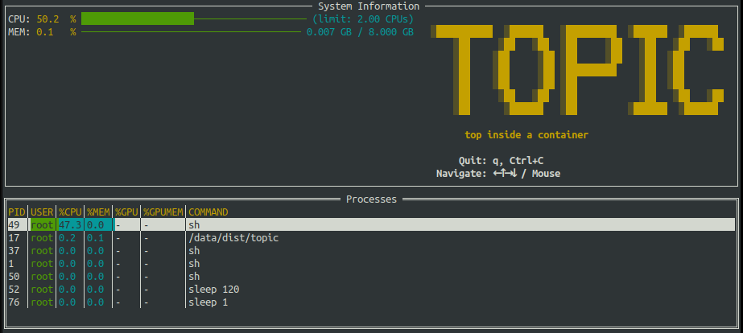

<div align="center">


### topic: top inside a container

**A `top`-like tool for containers that displays resource usage based on cgroup limits, not the host's resources.**

[](https://github.com/yurirocha15/topic/actions/workflows/ci.yml)
[](https://github.com/yurirocha15/topic/releases/latest)

</div>

---

### The Problem

Traditional monitoring tools like `top` or `htop`, when run inside a container, report resource usage as a percentage of the **host machine's total resources**. When working in containerized environments like Kubernetes Pods, it is hard to monitor the resource usage from inside the container.

For example, a container with a **2GB memory limit** on a 128GB host may be using 1.8GB of RAM. While `htop` would show a negligible system-wide usage, the container is actually at 90% of its capacity and is dangerously close to being OOMKilled with no warning.

### The Solution

**topic** (top inside a container) is a simple terminal-based monitoring tool that solves this problem. It reads the container's resource limits directly from the cgroup filesystem and calculates all usage percentages based on those limits.

This provides an accurate view of how close a container is to its resource boundaries, without the need to access the host or external monitoring tools.



---

### Installation

You can install the latest version of `topic` with a single command. The script will automatically detect your system's architecture (amd64/arm64) and install the binary to a directory in your `PATH`.

```bash
curl -s https://raw.githubusercontent.com/yurirocha15/topic/master/install.sh | bash
```

or for containers based on `alpine`:
```bash
wget -qO- https://raw.githubusercontent.com/yurirocha15/topic/master/install.sh | sh
``` 

The script will attempt to install to `/usr/local/bin` (prompting for `sudo` if needed). If that fails, it will fall back to `$HOME/.local/bin` and notify you if you need to add this directory to your `PATH`.

---

### Usage

After installation, simply run the command:

```bash
topic
```

#### Controls

* **Quit:** `q` or `Ctrl+C`
* **Navigate:** Use the arrow keys (`←`, `↑`, `→`, `↓`) to scroll through the process list, including horizontally for long command names.

---

### Building from Source

If you prefer to build the project yourself, you will need:
* Go (version 1.21 or later)
* `make`

Clone the repository and run the build command:

```bash
git clone https://github.com/yurirocha15/topic.git
cd topic
make build
```

The compiled binary will be available at `./dist/topic`.

---

### Contributing

Contributions are welcome! If you find a bug or have a feature request, please open an issue on the [GitHub Issues](https://github.com/yurirocha15/topic/issues) page.

---

### License

This project is licensed under the MIT License.
