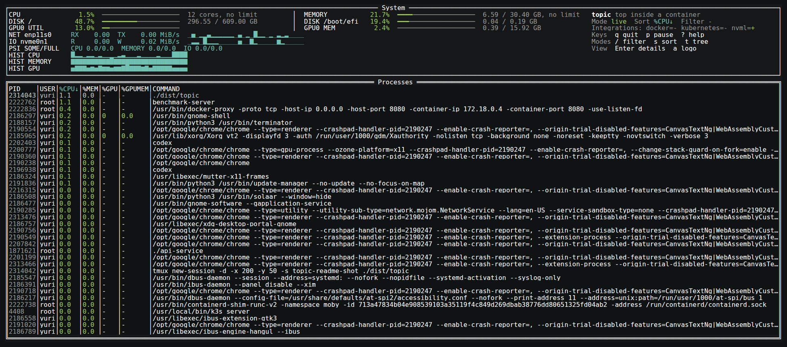

<div align="center">


### topic: top inside a container

**A `top`-like tool for containers that displays resource usage based on cgroup limits, not the host's resources.**

[](https://github.com/yurirocha15/topic/actions/workflows/ci.yml)
[](https://github.com/yurirocha15/topic/releases/latest)

</div>

---

### The Problem

Traditional monitoring tools like `top` or `htop`, when run inside a container, report resource usage as a percentage of the **host machine's total resources**. When working in containerized environments like Kubernetes Pods, it is hard to monitor the resource usage from inside the container.

For example, a container with a **2GB memory limit** on a 128GB host may be using 1.8GB of RAM. While `htop` would show a negligible system-wide usage, the container is actually at 90% of its capacity and is dangerously close to being OOMKilled with no warning.

### The Solution

**topic** (top inside a container) is a simple terminal-based monitoring tool that solves this problem. It reads the container's resource limits directly from the cgroup filesystem and calculates all usage percentages based on those limits.

This provides an accurate view of how close a container is to its resource boundaries, without the need to access the host or external monitoring tools.



---

### Installation

You can install the latest version of `topic` with a single command. The script will automatically detect your system's architecture (amd64/arm64) and install the binary to a directory in your `PATH`.

```bash
curl -s https://raw.githubusercontent.com/yurirocha15/topic/master/install.sh | bash
```

or for containers based on `alpine`:
```bash
wget -qO- https://raw.githubusercontent.com/yurirocha15/topic/master/install.sh | sh
``` 

The script will attempt to install to `/usr/local/bin` (prompting for `sudo` if needed). If that fails, it will fall back to `$HOME/.local/bin` and notify you if you need to add this directory to your `PATH`.

---

### Usage

After installation, simply run the command:

```bash
topic
```

Common options:

```bash
topic --refresh=2s        # change refresh interval
topic --no-gpu           # disable GPU collection
topic --no-docker        # disable Docker metadata lookup
topic --no-kubernetes    # disable Kubernetes metadata lookup
topic --no-nvml          # disable NVML/NVIDIA integration status
topic --ascii            # start with the large ASCII logo visible
topic --once --json      # print one JSON snapshot for scripts
topic --sort=mem         # initial sort: cpu, mem, gpu, gpumem, pid, user, command
```

#### Controls

* **Quit:** `q` or `Ctrl+C`
* **Navigate:** Use the arrow keys (`←`, `↑`, `→`, `↓`) or mouse to scroll through the process list.
* **Filter mode:** `/` to enter, type to filter, `Ctrl+U` to clear, `Esc` to leave.
* **Sort mode:** `s` to enter, `←`/`→` to choose a column, `↑`/`↓` to choose direction, `Esc` to leave.
* **Process details:** `Enter`
* **Signal process:** `k`
* **Pause refresh:** `p`
* **Tree view:** `t`
* **Toggle logo:** `a`
* **Help:** `?`

---

### Building from Source

If you prefer to build the project yourself, you will need:
* Go (version 1.23 or later)
* `make`

Clone the repository and run the build command:

```bash
git clone https://github.com/yurirocha15/topic.git
cd topic
make build
```

The compiled binary will be available at `./dist/topic`.

### Testing Integrations

The normal test suite uses fake Docker, Kubernetes, and NVML providers so it does not require host services:

```bash
make test-integrations
```

This target also runs `scripts/smoke-integration.sh`, which executes `topic --once --json` and validates that Docker, Kubernetes, and NVML integration statuses are present in the JSON snapshot.

Live integration discovery is opt-in:

```bash
TOPIC_LIVE_INTEGRATION_TESTS=1 make test-integrations
```

Live tests assert that discovery returns well-formed statuses without hanging or crashing. They do not require every integration to be available; unavailable Docker, Kubernetes, or NVIDIA/NVML environments are valid results.

---

### Contributing

Contributions are welcome! If you find a bug or have a feature request, please open an issue on the [GitHub Issues](https://github.com/yurirocha15/topic/issues) page.

---

### License

This project is licensed under the MIT License.
